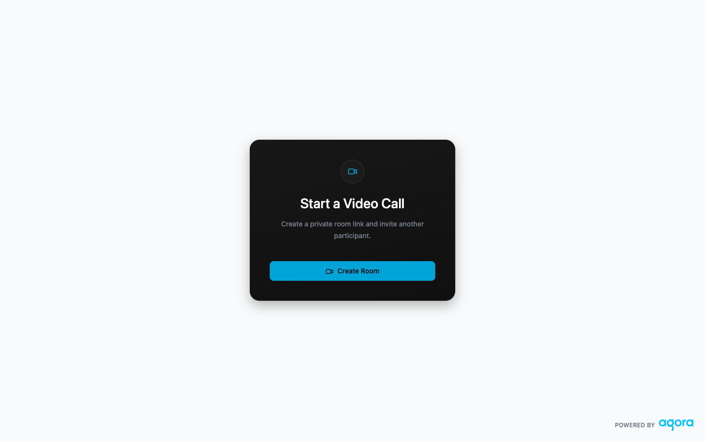
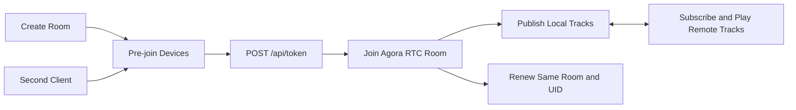

# Agora RTC Next.js Quickstart

A one-to-one audio and video calling starter built with Next.js and the Agora RTC Web SDK. Create a room, check your devices, join from one client, then open the same room URL from another client for the complete RTC experience.



## Prerequisites

- [Node.js 22+](https://nodejs.org/en/download/)
- pnpm 9.15.9
- An Agora project with an App ID and primary App Certificate

## Run It

1. Install dependencies:

   ```bash
   pnpm install
   ```

2. Create the local environment file:

   ```bash
   cp env.local.example .env.local
   ```

3. Add the two Agora values to `.env.local`:

   ```dotenv
   NEXT_PUBLIC_AGORA_APP_ID=your_app_id
   NEXT_AGORA_APP_CERTIFICATE=your_app_certificate
   ```

4. Check the environment and start the app:

   ```bash
   pnpm run doctor
   pnpm dev
   ```

5. Open [http://localhost:3000](http://localhost:3000) and select **Create Room**.

## Use the Quickstart

### Single-client success

On the pre-join screen, select your microphone and camera, choose their initial state, and select **Join Call**. A successful single-client run:

- issues an RTC token
- joins the generated room with a numeric UID
- publishes every available local media track
- keeps local preview and controls active
- shows **Waiting for another participant**

Single-client join is a supported quickstart result.

### Complete one-to-one experience

Copy the room URL and open that same URL in a second tab, window, browser profile, or device. Complete pre-join and join independently in each client. The complete RTC experience has two different UIDs and remote audio/video subscription in both directions.

When testing twice on one computer:

- wear headphones or mute one microphone to avoid feedback
- some cameras cannot be captured by two browser contexts; turn one camera off if needed
- both clients must use the exact same `/room/<room-id>` URL

## What You Get

- Next.js App Router UI matching the Agora agent starter's visual shell
- pre-join camera preview and device selection
- microphone and camera selection during the call
- explicit `agora-rtc-sdk-ng` join, publish, subscribe, renew, and cleanup lifecycle
- URL-only UUID rooms with no database
- RTC-only Publisher tokens generated server-side
- single-client waiting and two-participant call states
- responsive desktop and mobile layouts

## Token and Security Model

`POST /api/token` accepts a UUID room ID and an optional existing numeric UID. Initial requests receive a securely generated UID; renewal requests reuse the joined UID. Tokens use `buildTokenWithUid`, Publisher role, and a 3600-second relative expiration.

The App Certificate is never exposed to the browser. Token responses use `Cache-Control: no-store`.

This repository is a development demo. The token endpoint has no application login, room authorization, or built-in rate limiting. Before production use, add authentication, room authorization, server-controlled identity and role, rate limiting, abuse controls, and monitoring.

## Deploy to Vercel

Vercel can deploy this repository as a standard Next.js project:

1. Push or fork the repository to a Git provider supported by Vercel.
2. Import the repository in Vercel.
3. Add `NEXT_PUBLIC_AGORA_APP_ID` and `NEXT_AGORA_APP_CERTIFICATE` in Project Settings -> Environment Variables.
4. Deploy, create a room, and verify a single-client join on the HTTPS deployment.
5. Open the same deployed room URL in a second independent client for the recommended complete check.

The deployment is public by default. Use a dedicated Agora demo project, do not attach production credentials to untrusted Preview Environments, and remove the deployment or rotate the App Certificate when the demo is no longer needed.

A repository-specific **Deploy with Vercel** button can be added after this starter has a stable public repository URL.

## Architecture



## Commands

```bash
pnpm run doctor     # Node, pnpm, files, and non-empty env checks
pnpm dev            # Next.js development server
pnpm run lint       # ESLint
pnpm run typecheck  # TypeScript
pnpm test           # unit and component tests
pnpm run build      # production build
pnpm run verify     # lint + typecheck + test + build
```

## Repository Map

- `app/api/token/route.ts` - RTC token issue and renewal route
- `app/room/[roomId]/page.tsx` - validated room entry
- `components/room-experience.tsx` - pre-join and call state machine
- `components/pre-join.tsx` - local device setup
- `components/call-view.tsx` - one-to-one call layout
- `lib/rtc-session.ts` - Agora client lifecycle
- `lib/media-devices.ts` - partial media and device handling
- `tests/` - token, RTC, device, and UI contracts
- `AGENTS.md` - implementation invariants

## Troubleshooting

- **Credentials are not configured:** confirm both `.env.local` values are non-empty, then restart Next.js.
- **Camera or microphone permission was denied:** allow the site in browser permissions and select Retry Device Setup.
- **Only one media type works:** the quickstart supports audio-only or video-only joins when one device is unavailable.
- **No remote video:** confirm both clients use the same room URL and that the remote camera is enabled.
- **No remote audio:** confirm the remote microphone is enabled and browser audio playback is not muted.
- **Two local tabs cannot use the camera:** turn off one camera or use another browser/device.

## More Documentation

- [Agora Video Calling React Quickstart](https://docs.agora.io/en/video-calling/get-started/get-started-sdk?platform=react-js)
- [Agora RTC Web SDK API](https://api-ref.agora.io/en/video-sdk/web/4.x/index.html)
- [Deploy a Token Server](https://docs.agora.io/en/video-calling/token-authentication/deploy-token-server)

## License

Released under the [MIT License](./LICENSE).
